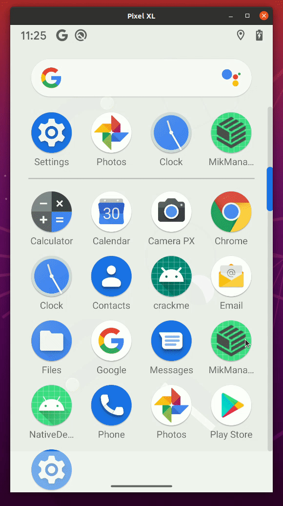

# MikManager
### 简介

MikManager是一个rom逆向工具的管理界面。该软件用于对接MikRom来实现rom层面的逆向工具。仅仅提供界面化操作管理，并将用户需求保存为json数据，由MikRom解析后进行相应的执行，并导出结果到对应的目录。

### 配套ROM
> https://github.com/dqzg12300/MikRom

### 调整说明

ROM从PixelExperience调整为aosp10，后续如果有更新，不再维护PixelExperience版本

新增全局配置可以修改为默认使用frida14的gadget（仅支持aosp版本的）

新增io重定向功能 （对应mikrom_1.0.2版本，暂未放出对应ROM下载）

### 提示
> 所有需要选择的文件都要放在对应目标的sdcard目录中，路径是`/sdcard/Android/data/<PackageName>`。
> 脱壳的dump结果会保存在`/sdcard/Android/data/<PackageName>/files/dump/`目录，有些app会缺少files这个目录，需要自己手动创建一下。

### 目录说明

`/sdcard/Android/data/<PackageName>/files/dump`该目录存放脱壳的结果，脱壳成功会生成对应的包名目录

`/sdcard/Android/data/<PackageName>/files/dump/<size>_classlist.txt`:脱壳应用的类列表

`/sdcard/Android/data/<PackageName>/files/dump/<size>_classlist_execute.txt`execute的触发时机获取的类列表

`/sdcard/Android/data/<PackageName>/files/dump/<size>_dexfile.dex`脱壳结果

`/sdcard/Android/data/<PackageName>/files/dump/<size>_deep_dexfile.dex`:更深调用的脱壳结果

`/sdcard/Android/data/<PackageName>/files/dump/<size>_dexfile_repair.dex`修复后的脱壳结果

### 功能

> * 内核修改过反调试
> * 开启硬件断点
> * 自动弹出USB调试
> * 脱壳（黑名单、白名单过滤、更深的主动调用链）
> * ROM打桩（ArtMethod调用、RegisterNative调用、JNI函数调用）
> * frida持久化（支持listen,wait,script三种模式）
> * 反调试（通过sleep目标函数，再附加进程来过掉起始的反调试）
> * trace java函数（smali指令的trace）
> * 内置dobby注入
> * 支持自行切换frida-gadget版本
> * 注入so
> * 注入dex（实现对应的接口触发调用。目前未完成）

### 更新说明
> * 优化可以控制是否打开debuggable，该功能对应lineageOS版本MikRom，这个选项修改后，需要重新安装app生效。

### 附录

该项目仅为个人练手作品，非商业项目。开源仅供学习，请勿用于非法用途。

### 感谢

> [FridaManager](https://github.com/hanbinglengyue/FridaManager)
>
> [FART](https://github.com/hanbinglengyue/FART)

### 界面展示

### 原理
[FartExt超进化之奇奇怪怪的新ROM工具MikRom](https://bbs.pediy.com/thread-271358.htm)